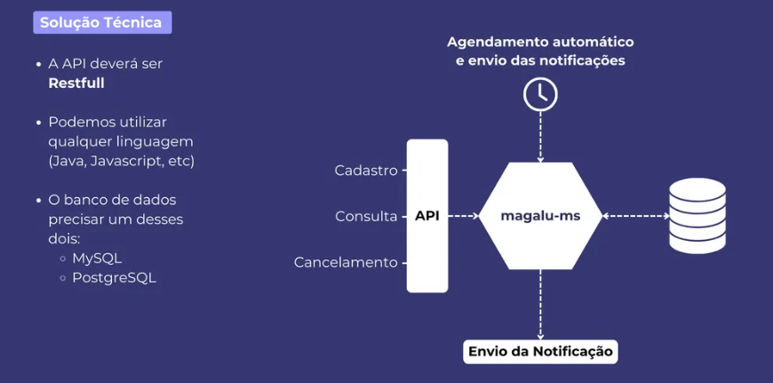
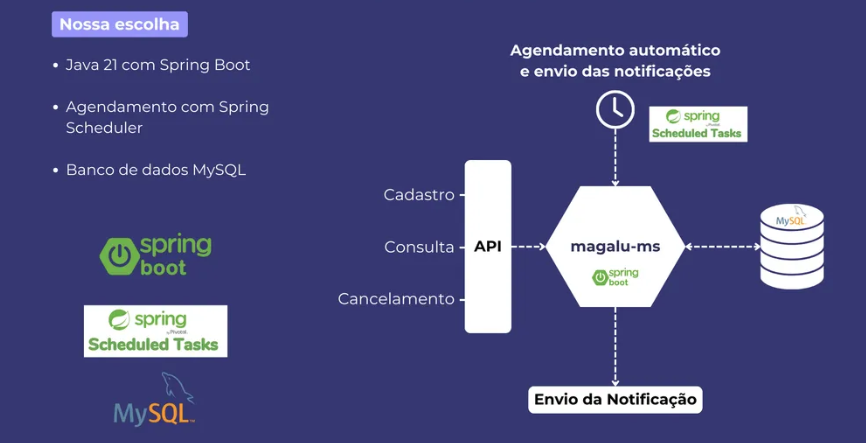
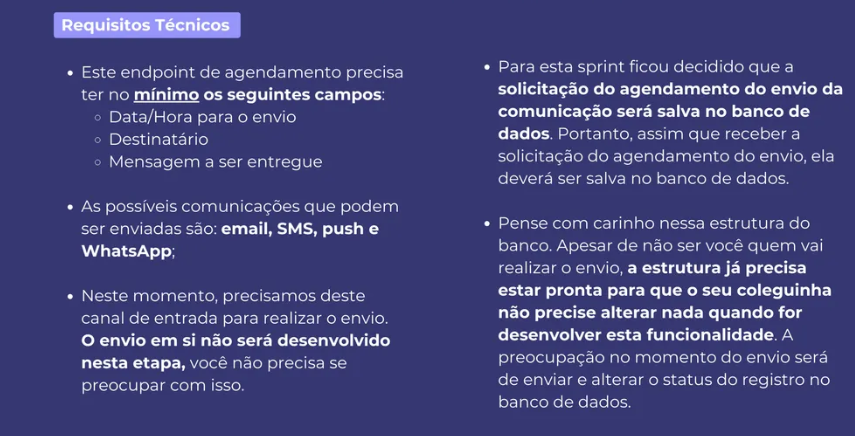

# Desafio Backend Magalu

Desafio para vaga backend do Magazine Luiza









## Endpoints
- Criar notificação
```bash
curl --request POST \
  --url http://localhost:8080/notifications \
  --header 'Content-Type: application/json' \
  --header 'User-Agent: insomnia/10.0.0' \
  --data '{
	"dateTime":"2024-11-05T19:00:00",
	"destination":"teste@teste.com",
	"message":"Seja bem vindo!",
	"channel":"EMAIL"
}'
```

- Consultar notificação
```bash
curl --request GET \
  --url http://localhost:8080/notifications/1 \
  --header 'User-Agent: insomnia/10.0.0'
```

- Cancelar notificação
```bash
curl --request DELETE \
  --url http://localhost:8080/notifications/1 \
  --header 'User-Agent: insomnia/10.0.0'
```